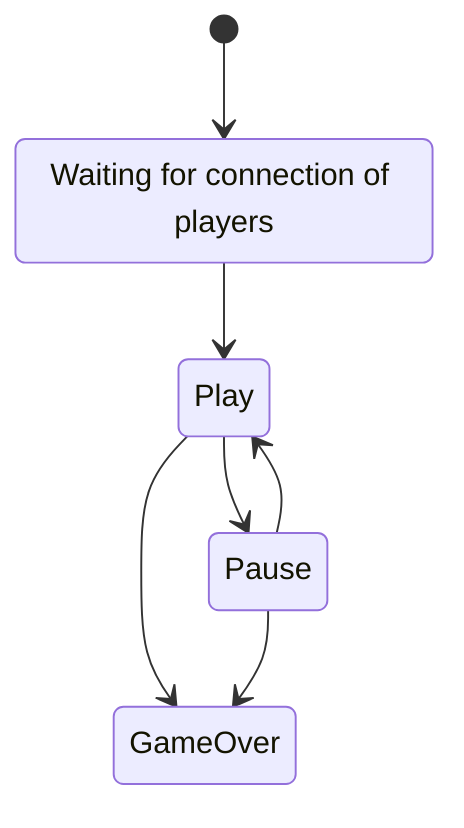

# UEE Member Template

## Description
It is a template to create a new member class.

### Game Session Lifecycle


## Dir structure
```
├── index.js # entrypoint of your module
├── index.test.js # tests for your module
└── events
    ├── outside_event.js # your member listens to this event
    └── your_event.js    # your member triggers this event
```

## Commands
### Install dependencies:
```bash
$ npm i
```
#### Run tests:
```bash
$ npm test
```

All files with the template name "*.test.js" will be run.

